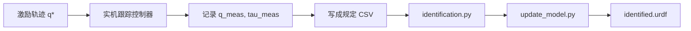

# KITT1_5 右臂动力学辨识：从仿真到实机

本文说明如何在本目录（`examples/kitt_1_5/`）一步步跑通仿真辨识，得到写回惯量后的 URDF；以及切换到实机时数据/轨迹应如何组织，并给出与 AI 协作时的提示词模板（保证输出格式可被现有脚本直接读取）。

相关入口脚本一览见同目录 [`README.md`](../README.md)。问题与已知坑见 [`issue.md`](../issue.md)。

> 若从仓库根目录打开：路径为 `examples/kitt_1_5/docs/运行指南_仿真到实机.md`。


---

## 0. 约定与目标产物

| 项 | 约定 |
|----|------|
| 辨识对象 | 右臂 7 关节：`right_arm_joint_1` … `right_arm_joint_7` |
| 末端 | 子模型到 `right_flange_link`（flange）；其后夹爪/相机不参与子模型辨识 |
| 工作目录 | **必须** `cd examples/kitt_1_5`（脚本用相对路径） |
| Conda | 推荐 `figaroh-examples` 或仓库文档中的 `figaroh-dev`；需已 `pip install -e` 安装 sibling `figaroh-plus` |
| 最终产物 | `results/urdf/right_arm_robot_identified.urdf`（完整 SIP 写回后的子模型 URDF） |
| 旁路产物 | `results/urdf/full_parameters_identified.csv`、`results/runs/.../parameters.csv`（基参数） |

仿真链路用 MuJoCo `mj_inverse` 造力矩；实机链路用同一套 CSV 文件名与列约定，只是数据来源换成编码器/力矩（或电流换算）。

---

## 1. 仿真：一步一步跑到辨识 URDF

### 1.1 环境

```bash
unset PYTHONPATH   # 避免 ROS 的 pinocchio 抢占
source /path/to/miniforge3/etc/profile.d/conda.sh
conda activate figaroh-examples   # 或 figaroh-dev
cd /path/to/figaroh-examples/examples/kitt_1_5
export MPLBACKEND=Agg
export PYTHONMALLOC=malloc        # 减轻退出时 pinocchio double-free
```

确认：

```bash
python -c "import figaroh, mujoco, pinocchio; print(figaroh.__file__)"
# 应指向 figaroh-plus 的 editable 安装，而非过期 site-packages
```

### 1.2（一次性）子模型与 MJCF

仓库通常已带好 `urdf/right_arm_robot.urdf` 与 `urdf/right_arm_robot.mjcf`，一般跳过：

```bash
python extract_right_arm.py   # 从整机 URDF 抽右臂到 flange
python urdf_to_mjcf.py        # 手写 MJCF，保证与 Pinocchio 动力学一致
```

### 1.3 激励轨迹

**推荐验证路径（快）**：Fourier，不必等 IPOPT。

```bash
# 与当前 config 采样一致时建议：12 s @ 1000 Hz（无噪声校验）
python generate_mujoco_data.py --trajectory fourier --noise-scale 0.0 --duration 12 --fs 1000
```

**正式激励（慢）**：IPOPT（见 `issue.md` ISSUE-001，可能数分钟～更久）：

```bash
python optimal_trajectory.py
python generate_mujoco_data.py --trajectory ipopt --noise-scale 1.0
```

生成文件（训练 + 验证）：

| 文件 | 含义 |
|------|------|
| `data/identification_q_simulation.csv` | 关节角（可含测量噪声） |
| `data/identification_tau_simulation.csv` | 关节力矩 |
| `data/identification_truth.npz` | 无噪声真值（仿真专用，绘图用） |
| `data/validation/` 下同名 CSV | 独立验证集 |

### 1.4（可选）看数据

```bash
python plot_identification_data.py
# → results/plots/
python view_identification_trajectory.py   # MuJoCo GUI 运动学回放
```

### 1.5 辨识

```bash
python identification.py --no-html-report
# 需要归档 / 验证裁定时去掉 --no-html-report，保留默认 --verify --archive
```

关注终端：

- `Condition`（宜 ≪ 1000；12 s / 1000 Hz 时约 40）
- `RMSE` / `Correlation`
- `Full-parameter reconstruction: ok`（需 config 中 `reconstruction.method: sdp` 且 `base_equality: soft`）

基参数归档示例：

`results/runs/<asset>/identification/<timestamp>/parameters.csv`

### 1.6 写回 URDF（标定结果落盘）

```bash
python update_model.py
```

默认输出：

- **`results/urdf/right_arm_robot_identified.urdf`** ← 目标文件  
- `results/urdf/full_parameters_identified.csv`（完整标准参数 + 来源标记 `sdp` / `urdf_prior`）

脚本会打印：

| 指标 | 含义 |
|------|------|
| RMSE URDF nominal | 名义模型力矩拟合 |
| RMSE identified base | 基参数 \(\varphi_b\) 拟合（主指标） |
| RMSE SDP θ_r (in-mem) | 内存中重建完整参数 |
| RMSE reloaded URDF | 回读写出 URDF 再算（若明显变差，说明写回/转换仍有问题，见文末注意） |

### 1.7 仿真最小命令清单（复制即用）

```bash
conda activate figaroh-examples
cd examples/kitt_1_5
unset PYTHONPATH
export MPLBACKEND=Agg PYTHONMALLOC=malloc

python generate_mujoco_data.py --trajectory fourier --noise-scale 0.0 --duration 12 --fs 1000
python identification.py --no-html-report --no-archive
python update_model.py
ls -la results/urdf/right_arm_robot_identified.urdf
```

---

## 2. 实机：与仿真的差异、怎么跑

实机**不再**调用 `generate_mujoco_data.py`。辨识与写回步骤（`identification.py` / `update_model.py`）不变，只换数据来源。



### 2.1 实机侧必做

1. **轨迹**：用与辨识同一关节顺序的 \(q^*(t)\)（来自 Fourier/`optimal_trajectory` 的 npz，或你们自己的规划器）。  
2. **跟踪**：位置/速度环跟踪 \(q^*\)；采样率与 config 中 `signal_processing.sampling_frequency` **一致**（当前常为 **1000 Hz**）。  
3. **记录**：每个采样点保存：
   - 关节角 \(q\)（rad，编码器）
   - 关节力矩 \(\tau\)（N·m；若只有电流，需乘力矩常数/减速比，并在文档中写清）
4. **导出 CSV**：列名、顺序、路径见下一节（与仿真文件同名即可直接跑辨识）。  
5. **验证集**：另采一段轨迹（或同轨迹另一天/另一次）放到 `data/validation/`，同文件名。  
6. 再跑：`identification.py` → `update_model.py`。

### 2.2 实机相对仿真的注意点

| 主题 | 建议 |
|------|------|
| 摩擦 / 驱动 | 实机常需打开 config 里摩擦、转子惯量等项；仿真默认可关 |
| 滤波 | `cutoff_frequency` 按实机噪声调；须 \(< fs/2\) |
| 力矩来源 | 电流换算误差会直接进 \(\varphi_b\)；标定力矩常数 |
| 末端负载 | 子模型到 flange；若实机带着夹爪，要么改提取边界，要么把夹爪惯量并入末端并在对比整机 MJCF 时说明 |
| 与整机 MJCF | `mjcf/kitt_full_robot.xml` 的 `Joint7_R` 常合并夹爪质量；子模型 URDF 拆成 `Joint7_R`+`right_flange_link`，**不能逐项裸比 Joint7** |
| soft-SDP | 辨识 \(\varphi_b\) 与物理可行集之间用软约束；不要改回硬等式 `Mθ=φ_b` |

---

## 3. 数据与轨迹格式（仿真 / 实机共用契约）

现有加载器读的是固定文件名与列约定；**实机导出必须兼容**，否则要改 `utils/kitt_1_5_tools.py`。

### 3.1 关节角 CSV

- 路径：`data/identification_q_simulation.csv`（验证：`data/validation/identification_q_simulation.csv`）
- 无时间列；一行一个采样点；单位 **rad**
- 表头（必须一致）：

```text
q0,q1,q2,q3,q4,q5,q6
```

对应：

| 列 | 关节 |
|----|------|
| q0 | right_arm_joint_1 |
| q1 | right_arm_joint_2 |
| … | … |
| q6 | right_arm_joint_7 |

### 3.2 力矩 CSV

- 路径：`data/identification_tau_simulation.csv`
- 单位 **N·m**
- 表头：

```text
tau1,tau2,tau3,tau4,tau5,tau6,tau7
```

与 `q0…q6` **同行对齐**（第 \(i\) 行是同一时刻）。

### 3.3 采样率

在 `config/kitt_1_5_unified_config.yaml`：

```yaml
tasks:
  identification:
    signal_processing:
      sampling_frequency: 1000.0   # 必须等于实机落盘采样率
      cutoff_frequency: 50.0
```

辨识内部用该频率对 `q` 滤波并数值微分得 \(\dot q,\ddot q\)；**不要**在 CSV 里再塞 dq/ddq（当前管线不读）。

### 3.4 激励轨迹 npz（可选，给控制器播放）

`data/trajectories/right_arm_optimal_trajectory.npz` 建议字段：

| key | shape | 含义 |
|-----|-------|------|
| `t` | (N,) | 时间 s |
| `q` | (N, 7) | 关节角 rad |
| `dq` | (N, 7) | 可选 |
| `ddq` | (N, 7) | 可选 |

关节列顺序同 `q0…q6`。

---

## 4. 与 AI 协作：如何让它按固定形式出代码/数据

实机对接时，把下面「系统约定」贴进对话（Cursor / Chat），再追加具体任务。目标是：**AI 只生成符合契约的导出脚本与文件，不擅自改辨识入口文件名。**

### 4.1 推荐系统提示（可直接复制）

```text
你在 figaroh-examples/examples/kitt_1_5 工程里工作。

【硬约束】
1. 工作目录始终是 examples/kitt_1_5/。
2. 辨识只读这两个训练文件（验证集在 data/validation/ 下同名）：
   - data/identification_q_simulation.csv
   - data/identification_tau_simulation.csv
3. CSV 格式不可改：
   - q 表头：q0,q1,q2,q3,q4,q5,q6（rad，对应 right_arm_joint_1..7）
   - tau 表头：tau1,tau2,tau3,tau4,tau5,tau6,tau7（N·m）
   - 无时间戳列；q 与 tau 同行数、同行对齐
4. 采样率必须与 config/kitt_1_5_unified_config.yaml 里
   tasks.identification.signal_processing.sampling_frequency 一致。
5. 不要把夹爪/相机链节写进子模型辨识 CSV；末端以 right_flange_link 为界（除非我明确要求改模型）。
6. 辨识完成后用 python update_model.py 生成
   results/urdf/right_arm_robot_identified.urdf。
7. 改代码保持最小 diff；不要新建无关 markdown，除非我要求。
8. 实机相关新代码放在 examples/kitt_1_5/real/ 或 scripts/ 下，通过写上述 CSV 与现有 identification.py 对接，
   不要分叉一套新的辨识主程序。

【输出形式】
- 先给：文件路径列表 + 每个文件职责（3～6 条）。
- 再给：可运行代码（完整文件，不要省略关键函数）。
- 最后给：我在实机上应执行的命令清单（bash）。
- 若涉及力矩由电流换算，单独写清：tau = Kt * gear * current 的假设与单位。
```

### 4.2 任务提示示例

**A. 写实机录包 → CSV 转换器**

```text
根据 4.1 的硬约束，写 real/export_identification_csv.py：
输入：rosbag2 / 自定义 hdf5（说明你假设的 topic 名与字段）；
输出：覆盖 data/identification_q_simulation.csv 与 tau CSV；
另写 data/validation/ 的划分方式（例如后 20% 或第二次 trial）。
采样率默认读 unified config。提供 --dry-run 只打印形状与关节限幅违规数。
```

**B. 写轨迹播放节点**

```text
写 real/play_trajectory.py：读取 data/trajectories/*.npz 的 t,q，
按 sampling_frequency 向控制器发布 right_arm_joint_1..7 位置命令。
缺 dq 时用差分；发布接口先用占位回调 + 打印，并留 TODO 接我司 SDK。
```

**C. 只要数据规范检查**

```text
写 real/check_csv_contract.py：检查 q/tau 表头、行数一致、无 NaN、
|q| 在 config joint_limits.position 内、fs 与文件时长自洽。
失败时 exit code 1 并打印首个违规行号。
```

### 4.3 AI 交付物验收清单

- [ ] 生成或覆盖的 CSV 能被 `python identification.py --no-html-report` 直接读入  
- [ ] `Loaded N samples` 与实机时长 × fs 一致  
- [ ] `update_model.py` 产出 `results/urdf/right_arm_robot_identified.urdf`  
- [ ] 未改坏 `q0…q6` / `tau1…tau7` 表头  
- [ ] 实机专用代码未复制整份 `identification.py`

---

## 5. 配置开关速查

`config/kitt_1_5_unified_config.yaml` 中与「出 URDF」强相关：

```yaml
tasks:
  identification:
    signal_processing:
      sampling_frequency: 1000.0
      cutoff_frequency: 50.0
    physical_consistency:
      enabled: true
    reconstruction:
      enabled: true
      method: sdp
      prior:
        source: dict          # URDF 标准参数作先验
      sdp:
        solver: cvxopt
        base_equality: soft   # 必须 soft；hard 在有噪声/微分误差时不可行
        base_weight: 1.0
```

---

## 6. 已知限制（写文档时需知情）

1. **写回 URDF 的回读 RMSE** 若远大于内存中 SDP RMSE，说明 `update_model.py` 的动态参数→URDF `I_com` 转换或回读对齐仍有问题；此时以 `parameters.csv` / `full_parameters_identified.csv` 与基参数力矩 RMSE 为准，URDF 需修转换后再用于控制。  
2. **整机 `mjcf/kitt_full_robot.xml`** 与子模型 URDF 在 `Base_R` / `Joint7_R` / flange 拓扑上不一致，对比惯量时要按「同名 body」并做末端质量预算，不能只看 Joint7 一行。  
3. **IPOPT 轨迹** 可能极慢；验证阶段用 Fourier 即可。  
4. 进程退出时偶发 pinocchio `double free`：加 `PYTHONMALLOC=malloc`，不影响已写出的文件。

---

## 7. 流程总图（仿真）

```text
extract_right_arm.py ─┐
urdf_to_mjcf.py      ─┼─► 子模型 URDF/MJCF
                      │
optimal_trajectory.py ┘（可选）
        │
generate_mujoco_data.py ──► data/*_simulation.csv
        │
identification.py ──► φ_b + soft-SDP θ_r（内存 / runs 归档）
        │
update_model.py ──► results/urdf/right_arm_robot_identified.urdf
```

实机把 `generate_mujoco_data.py` 换成「跟踪 + 录包 + 导出同名 CSV」，其余三步相同。
